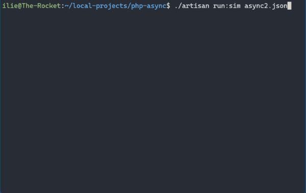
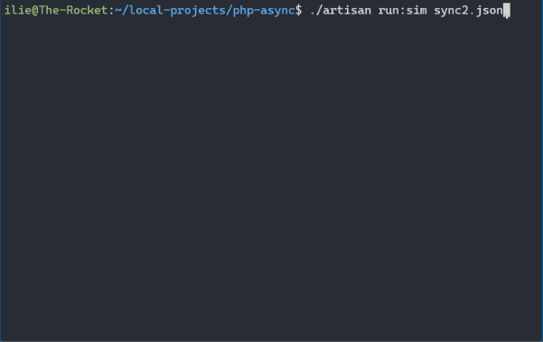

# Laravel - Guzzle HTTP Client - Async Demo

Pretty Laravel CLI demo on how to use Guzzle HTTP Client in async mode.

## Async Demo



## Sync Demo



## How to run


Step 1 - Start the built-in web server

```shell
node resources/js/web-server.js
```

Step 2 - run the simulation with a config file

```shell
./artisan run:sim async2.json
```

Or

```shell
./artisan run:sim sync2.json
```

## Interesting Bits and Bobs

### Writing a slow server web server

So we can see what is happening I needed a slow web server. 
`artisan serve` does not allow concurrent requests, so I chose to 
work with `node` server instead, which has a very simple setup.


### Testability 

In order to test this software I wanted to make sure it runs the same
way every single time, so if there is a bug, I can repeat the process 
over and over until is fixed.

To accomplish this I am using config files that will set-up everything
in the simulation. From how many requests there are, to how these 
requests will be served: how big, how slow, and first byte delay. 

Using input configuration files makes that easy. 

### Observability - Laravel CLI Animations

Just summarizing the time to completion did not fully show-case the async nature of
Guzzle HTTP. 

I wanted to visually see how the progress is happening. 

Using a CLI display was the fastest way to implement this, though a web view would also be
nice. 

To keep track of the HTTP progress I've used Guzzle's `progress` hook that would then 
send updates into a state monitor. Then a CLI renderer observes this state and updates
the CLI accordingly. 

Thankfully, Laravel already comes with a powerful and flexible CLI management library: 
[Symfony Console](https://symfony.com/doc/current/components/console.html)


## Config file format

```json
{
    "type": "sync",
    "requests": [
        {
            "size": 10,
            "chunks": 10,
            "delay": 150,
            "fbd": 400
        },
        {
            "size": 10,
            "chunks": 10,
            "delay": 150,
            "fbd": 200
        }
    ]
}
```

- Type: `sync` or `async`
- Requests: array of request configurations
  - size - how big should the request should be
  - chunks - how to split the response in chunks
  - delay - how much to wait between chunks - to simulate slowness
  - fbd - first byte delay - how much to wait before sending the first chunk
